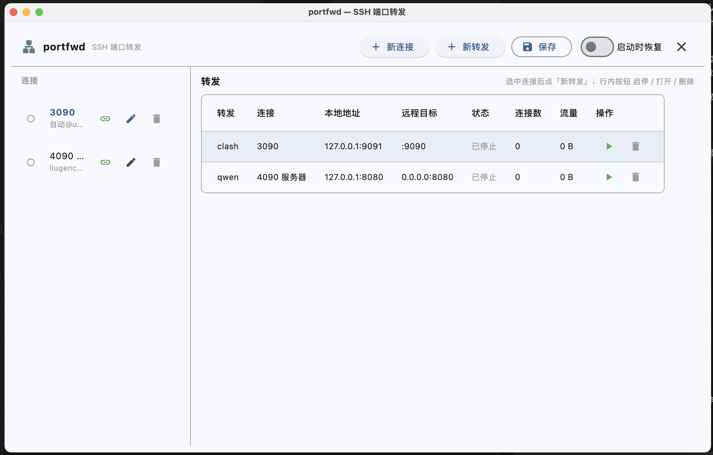
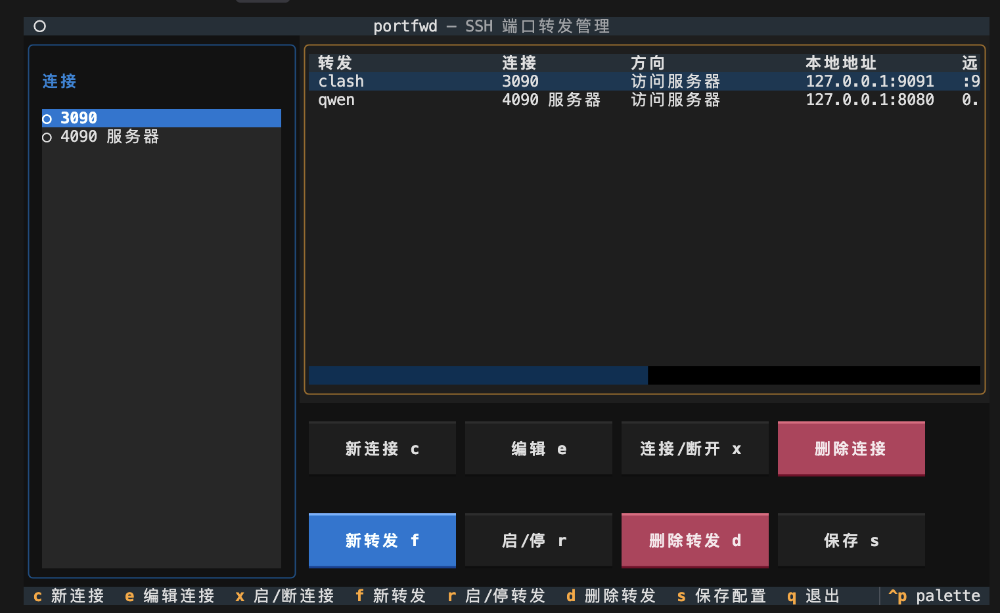

# portfwd

SSH 端口转发管理工具，风格对齐 VS Code Remote-SSH 的 PORTS 面板（TUI + GUI 双界面）：
把远程主机上的端口通过 SSH 隧道暴露到本机 `127.0.0.1`，本地浏览器直接访问即可打开
远程服务；反向则让**服务器**通过 SSH 隧道访问**本机**服务（典型：服务器使用本机
HTTP/SOCKS 代理出网）。

## 功能

- **连接管理**：保存任意多个 SSH 连接；支持直接输入 IP/域名，或输入
  `~/.ssh/config` 里的别名（自动解析 host / port / user / 密钥，与 `ssh` 命令行为一致）
- **端口转发（正向）**：本机监听 → SSH → 远程目标；每个连接下可保存多条规则，
  随时启停；本地端口冲突检测；浏览器一键打开
- **端口转发（反向）**：远程 127.0.0.1 监听 → SSH → 本机目标（TCP）；远程监听端
  仅允许 loopback（127.0.0.1/localhost，持久化时规范化为 127.0.0.1），绝不默认
  暴露 0.0.0.0；同一连接内不允许重复的远程监听 host:port，允许多条反向规则
  指向同一本机目标
- **远程端口发现**：一键拉取远程 `ss`/`netstat`/`lsof` 监听端口列表，选中自动填入（正向）
- **流量统计**：每条转发（两个方向）实时显示活跃连接数与累计流量
- **自动恢复**：重启 portfwd 后自动重连并恢复已保存的转发
- **认证**：自动（agent/默认密钥 → 失败弹密码框）/ 仅密钥 / 密码（可保存到配置）
- **主机密钥**：`accept-new` 策略（首次自动记录到 known_hosts，密钥不匹配则拒绝）

## 界面预览

### GUI



### TUI



## 安装

```bash
cd ~/portfwd
.venv/bin/pip install -e .     # 已装好可跳过
alias portfwd="~/portfwd/.venv/bin/portfwd"   # 或写入 ~/.zshrc
```

## 使用

```bash
portfwd           # 启动 TUI
portfwd -v        # TUI 带调试日志
portfwd --gui     # 启动 GUI（图形窗口，Flet）
portfwd-gui       # 同上，独立入口
```

### GUI 界面

左侧连接列表（● 已连接 / ○ 未连接），每行带 连接/断开、编辑、删除；
右侧转发行：名称、所属连接、方向（访问服务器 / 服务器访问本机）、
本机端地址、远程端地址、状态、连接数、流量、启停 / 打开 / 删除。
顶栏可保存配置、退出；左下开关控制「启动时自动恢复」。
新建转发时先选方向，字段随方向切换。

**操作**（快捷键见窗口底部 Footer）：

| 键 | 动作 |
| :- | :- |
| `c` | 新建连接（支持填 `~/.ssh/config` 别名） |
| `e` | 编辑选中连接 |
| `x` | 连接 / 断开选中连接 |
| `f` | 给选中连接新建转发 |
| `r` | 启 / 停选中转发 |
| `d` | 删除选中转发（表中回车也会切换） |
| `s` | 保存配置到 `~/.portfwd/config.json` |
| `q` | 退出（自动清理所有隧道） |

新建转发时可点「发现远程端口」，在弹出的列表里选中端口即可自动填入；
远程主机填 `127.0.0.1` 表示 SSH 会话所在主机，填其它 IP 则经隧道二次转发
（VS Code 同款高级用法）。

### 转发方向

新建转发时选择方向，两端 host:port 的角色随之相反：

| 方向 | 本机端 | 远程端 | 典型用途 |
| :- | :- | :- | :- |
| 访问服务器端口（正向） | 监听端 `127.0.0.1:<本地端口>` | 目标 `<远程主机>:<远程端口>` | 浏览器打开远程 Web 服务 |
| 服务器访问本机（反向） | 目标 `<本机地址>:<本机端口>` | 监听端 `127.0.0.1:<远程监听端口>` | 服务器使用本机代理 |

**典型反向规则**：服务器 `127.0.0.1:17890` → 本机 `127.0.0.1:7890`
（本机跑 HTTP/SOCKS 代理时，服务器把 `HTTP_PROXY=http://127.0.0.1:17890`
配进环境变量即可借用本机代理出网）。反向规则只转发 TCP，不实现
HTTP/SOCKS 协议本身。

**服务端 SSH 配置要求**（反向转发）：`sshd_config` 需保持
`AllowTcpForwarding yes`（默认即开启）；若服务器管理员通过 `Match` 段或
`PermitListen` 等策略禁止 remote forwarding，portfwd 会给出
「服务器拒绝了远程端口转发」的明确提示。反向监听只绑定服务器上的
`127.0.0.1`，因此不需要 `GatewayPorts`，也不会对公网暴露端口。

## 配置

- 配置目录：`~/.portfwd/`（环境变量 `PORTFWD_HOME` 可覆盖）
- `config.json` 和配置目录分别为 0600/0700；macOS 有 `security` 命令时，密码会迁移到
  Keychain，JSON 中不再保存密码。其它平台保留 0600 文件回退。

## 测试

```bash
.venv/bin/python -m pytest                # 全部测试（推荐）
.venv/bin/python tests/test_engine.py     # 引擎集成测试（本地 echo，FakeTransport）
.venv/bin/python tests/test_reverse.py    # 反向转发测试（FakeTransport/FakeChannel + 本机 echo）
.venv/bin/python tests/test_ui.py         # TUI 无头冒烟测试
.venv/bin/python tests/test_gui.py        # GUI 无头冒烟测试（FakePage，无需显示）
.venv/bin/python tests/test_buttons.py    # TUI 按钮链路回归
.venv/bin/python -m unittest discover -s tests -p 'test_regressions.py'
.venv/bin/ruff check portfwd tests        # 静态检查（开发依赖）
```

## macOS 应用

需要在 macOS 上预先安装固定版本的构建 CLI 和完整 Xcode（Command Line Tools 不包含
`xcodebuild`）：

```bash
.venv/bin/pip install -e '.[build]'
xcode-select --switch /Applications/Xcode.app/Contents/Developer
./scripts/build_macos.sh
```

脚本默认按当前机器架构构建（Apple Silicon 为 `arm64`，Intel 为 `x64`），也可用
`MACOS_ARCH` 覆盖。产物位于 `build/macos/portfwd.app`。可用 `BUILD_VERSION` 和递增的
`BUILD_NUMBER` 覆盖版本信息。签名和公证需要在发布机上另行配置 Developer ID 证书。

## 实现说明

- `portfwd/models.py` — 纯数据模型与序列化；`FwdDirection` 区分正向/反向
  （旧配置缺字段默认正向），反向远程监听端强制 loopback 并规范化为 127.0.0.1
- `portfwd/config.py` — 配置持久化 + `~/.ssh/config` 解析（paramiko SSHConfig）
- `portfwd/forwarding.py` — SSH 连接/转发引擎：
  - 正向：本地监听 → `direct-tcpip` channel → 双向泵；
  - 反向：`Transport.request_port_forward` 在服务器 loopback 起监听，
    Transport 线程回调 handler 只做路由并立即派 daemon 线程连本机目标，
    复用同一套 `_pump`/流量计数/统一关闭逻辑；`cancel_port_forward` 清理，
    启动失败原子回滚，停止与新 channel 到达的竞态下新连接立即关闭；
  - 心跳监测断线；加载 `known_hosts` 并执行 `accept-new` 主机密钥策略；
  - `open_forward_for_session` 按方向分派，TUI/GUI worker 共用
- `portfwd/app.py` — Textual TUI；阻塞 SSH 操作全部走 worker 线程，
  引擎事件经队列推送，流量由 0.5s 定时器轮询
- `portfwd/gui.py` — Flet GUI（`portfwd --gui` / `portfwd-gui`）；与 TUI 共用
  引擎与配置，阻塞操作走 `page.run_thread`，状态经队列 + 0.5s `run_task` 轮询，
  窗口关闭和 `atexit` 都会清理 SSH 会话
